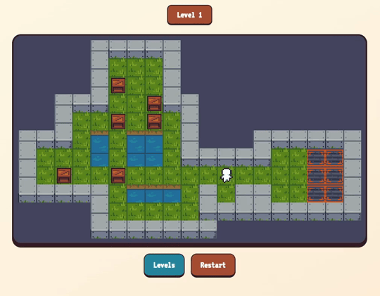
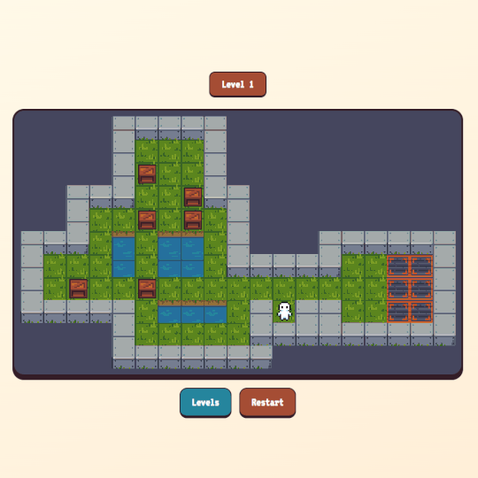
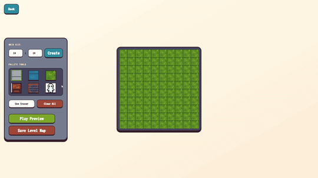
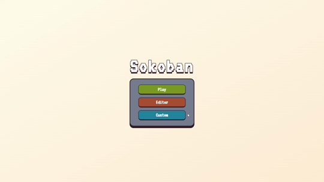

# Sokoban




[Description](#description) • [Features](#features) • [Tech Stack](#techstack) • [Installation](#installation)

## Description

A minimalist, responsive, and aesthetically pleasing **Sokoban** game built from scratch using `React`, `TypeScript`, and `Tailwind CSS`.

The project focuses on grid-based movement logic, clean code architecture, and a cozy retro-indie aesthetic inspired by classic pixel-art games. The design principles and focus on smooth, isolated state tracking were heavily inspired by the game design philosophy of **Jonathan Blow**.

## Features

### 50 Built-in Levels & Campaign Mode

Explore a carefully curated sequence of 50 puzzles with a gradual difficulty curve. The progression system dynamically tracks your unlocked levels, saving state and blocking unreached areas, ensuring a focused and rewarding gameplay loop. Includes full history tracking for non-punishing puzzle solving.



### Map Editor

A fully functional, grid-based layout designer. The editor provides real-time canvas resizing, drawing tools, and eraser modes. It translates mouse brush-strokes into underlying block arrays, serving as a powerful developer and player tool for level creation.



### Isolated Custom Playtesting & Import

Players can export their maps or download custom `.txt` layouts from external sources. The game engine utilizes a robust `FileReader` parsing pipeline with flood-fill algorithms to clean boundaries, wrap external maps into water/walls seamlessly, and playtest them in a safely isolated environment without breaking main campaign states.



## TechStack

- **React** — UI and state management
- **TypeScript** — type safety and better DX
- **Tailwind CSS** — styling
- **localStorage** — persistent data

## Installation

Clone the repository

```bash
git clone https://github.com/Woefulking/Sokoban.git
cd Sokoban
```

Install dependencies

```bash
npm install
```

Run the project

```bash
npm run dev
```
